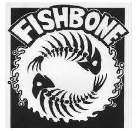

# WinsPool: The Ultimate NFL Draft Tracker

WinsPool is a premium, real-time web application designed for friend groups to manage their NFL team draft pools. Players draft a set of teams at the start of the season, and the leaderboard is determined by the cumulative regular-season wins of their selected roster.



## Key Features

### AI Weekly Recaps
Get a professional (and slightly roasting) summary of every NFL week. 
- **Persona**: A witty, high-energy sports commentator.
- **Admin Control**: Admins can preview, refine, and broadcast summaries to all players via email.
- **Data-Driven**: Summaries are generated using Gemini AI based on the latest game results.

### Live Draft Room
A real-time, WebSocket-powered interface for the big day.
- **Live Sync**: See picks as they happen across all devices.
- **Admin Overrides**: Force or undo picks to keep the draft moving.
- **Analytics**: Integrated preseason projections and win-total confidence scores to help you make the best pick.

### Dynamic Standings & Analytics
- **Live Leaderboards**: Track group rankings with automated win/loss updates.
- **What-If Scenarios**: A matrix view to see how future outcomes affect the pool.
- **Historical Context**: Full support for switching between the current season and historical data (2024 and earlier).

### Premium Design
- **Glassmorphism**: A sleek, modern dark-mode aesthetic with frosted-glass components and vibrant accents.
- **Responsive**: Fully optimized for both desktop data-gazing and mobile updates.

---

## Technology Stack

| Layer | Technology |
|---|---|
| **Backend** | Python (FastAPI), Uvicorn |
| **Database** | Google Cloud Firestore (Primary), Local Pickle (.local_db for dev) |
| **Logic** | Pandas, NumPy, Google Generative AI (Gemini) |
| **Frontend** | Vanilla JavaScript (ES6 Modules), HTML5, CSS3 (Custom Design System) |
| **Real-time** | WebSockets |
| **Auth** | Role-Based Access Control (Admin vs. User), Session Persistence |

---

## Getting Started

### Prerequisites
- Python 3.11+
- Google Gemini API Key (for AI features)
- Firebase Service Account (for Firestore)

### Installation
1. Clone the repository.
2. Install dependencies:
   ```bash
   pip install -r requirements.txt
   ```
3. Set up your environment variables:
   - `GEMINI_API_KEY`: Your Google AI key.
   - `USE_LOCAL_DATA`: Set to `True` for development without Firestore.
   - `FIREBASE_CREDENTIALS`: Path to your service account JSON (if not in root).
   - `DEBUG_PAGE_LOAD`: Set to `True` to log page-load timing to console. Dev-only; defaults to `False`.

4. Run the development server:
   ```bash
   uvicorn main:app --reload
   ```

### Admin Access
To access the Admin Portal (`/admin`), your player ID must be assigned the `admin` role in the `players` collection.

---

## Project Structure

```text
WinsPool/
├── main.py             # FastAPI App & WebSocket Orchestrator
├── routes/             # Modular API & Page Routing
├── services/           # Business Logic (AI, Draft, Data, Analysis)
├── templates/          # Jinja2 Layouts & Page Content
├── static/             # Assets, Global CSS, and JS Modules
├── scripts/            # CLI Tools (Scrapers, Sync, Recaps)
└── .local_db/          # Persistent local data cache
```

---

## Rules & Configuration
- Each player drafts **3 NFL teams** (Configurable in `draft_order_rules`).
- Rankings are determined by the sum of wins.
- Standard tiebreakers include Head-to-Head and specific round-robin results.

---