# Database Schema and Data Models

## Overview

WinsPool uses a dual-storage architecture:

- **Production**: Google Cloud Firestore (NoSQL document database)
- **Development**: Local `.pkl` (Pandas pickle) files in `.local_db/`

The runtime mode is controlled by the `USE_LOCAL_DATA` environment variable. In local mode, `db_service.get_collection_df()` reads from `.pkl` files instead of Firestore. Write operations in local mode are reflected onto `.pkl` files via the `_mutate_local()` helper.

---

## Firestore Collections

### `players`

Stores all pool participants.

| Field | Type | Description |
|---|---|---|
| `playerId` | `int` | Unique numeric identifier (auto-incremented) |
| `fullName` | `string` | Display name |
| `nickName` | `string` | Short name for UI |
| `email` | `string` | Standardized (lowercase, trimmed) email address |
| `cell` | `string` | Phone number (optional) |
| `role` | `string` | `"admin"` or `"user"` |
| `password_hash` | `string` | bcrypt hash (12 rounds) of the player's password. Legacy SHA-256 hashes (64-char hex) are supported for migration — verified and automatically upgraded on next login. |
| `mfa_code` | `string` | One-time MFA verification code (optional) |
| `failed_setup_attempts` | `int` | Rate limiter counter for password setup |
| `lockout_until` | `float` | Unix timestamp of lockout expiry (optional) |

**Document ID**: `{playerId}`

---

### `draft_order`

Defines the draft position for each player in a given season.

| Field | Type | Description |
|---|---|---|
| `season` | `int` | NFL season year (e.g., 2024) |
| `draftOrder` | `int` | Position in the draft (1-based) |
| `playerId` | `int` | Reference to `players.playerId` |

**Document ID**: `{season}_{draftOrder}`

---

### `draft_order_rules`

Defines the snake-draft pick allocation rules per round.

| Field | Type | Description |
|---|---|---|
| `season` | `int` | NFL season year |
| `rule` | `int` | Rule index (1-based) |
| `pickOne` | `int` | Draft position for Round 1 |
| `pickTwo` | `int` | Draft position for Round 2 |
| `pickThree` | `int` | Draft position for Round 3 |

**Document ID**: `{season}_{rule}`

---

### `draft_results`

Records each completed draft pick.

| Field | Type | Description |
|---|---|---|
| `season` | `int` | NFL season year |
| `draftPick` | `int` | Sequential pick number (1-based) |
| `playerId` | `int` | Player who made the pick |
| `team` | `string` | NFL team abbreviation (e.g., `"KC"`, `"SF"`) |
| `executedBy` | `string` | Player ID who executed the pick (for admin-forced picks) |
| `time_taken_seconds` | `float` | Duration the player took to make the pick |

**Document ID**: `{season}_{draftPick}`

---

### `nfl_games`

NFL game data sourced from LeeSharpe/nfldata on GitHub.

| Field | Type | Description |
|---|---|---|
| `game_id` | `string` | Unique game identifier |
| `season` | `int` | NFL season year |
| `game_type` | `string` | `"REG"`, `"POST"`, etc. |
| `week` | `int` | NFL week number |
| `gameday` | `string` | Date (YYYY-MM-DD) |
| `gametime` | `string` | Kickoff time (HH:MM) |
| `home_team` | `string` | Home team abbreviation |
| `away_team` | `string` | Away team abbreviation |
| `home_score` | `float` | Home team final score |
| `away_score` | `float` | Away team final score |
| `result` | `float` | `home_score - away_score` (null if unplayed) |
| `spread_line` | `float` | Betting spread |
| `total_line` | `float` | Over/under total |
| `home_moneyline` | `float` | Home team moneyline |
| `home_spread_odds` | `float` | Home spread odds |

**Document ID**: `{game_id}`

---

### `nfl_standings`

NFL team standings by season.

| Field | Type | Description |
|---|---|---|
| `season` | `int` | NFL season year |
| `team` | `string` | Team abbreviation |
| `wins` | `int` | Regular season wins |
| `losses` | `int` | Regular season losses |
| `ties` | `int` | Ties |

**Document ID**: `{season}_{team}`

---

### `nfl_teams`

Static NFL team reference data.

| Field | Type | Description |
|---|---|---|
| `team` | `string` | Abbreviation (e.g., `"KC"`) |
| `team_name` | `string` | Full name (e.g., `"Kansas City Chiefs"`) |
| `team_conf` | `string` | Conference (`"AFC"` / `"NFC"`) |
| `team_division` | `string` | Division (e.g., `"West"`) |
| `team_color` | `string` | Primary hex color |
| `team_color2` | `string` | Secondary hex color |

**Document ID**: `{team}`

---

### `preseason_predictions`

Preseason win total projections, either uploaded manually or scraped.

| Field | Type | Description |
|---|---|---|
| `season` | `int` | NFL season year |
| `team` | `string` | Team abbreviation |
| `projected_wins` | `float` | Consensus average projected wins |
| `std_dev` | `float` | Standard deviation across sources |
| `sources` | `map` | `{ "BR": 9.5, "FPI": 10.2, ... }` (per-source values) |
| `sources_count` | `int` | Number of sources contributing (aggregate scraper format) |
| `predictions` | `array` | Array of `{team, projected_wins, std_dev, sources_count}` (aggregate format) |

**Document ID**: `{season}_{team}` (per-team format) or `{season}` (aggregate format)

---

### `analytics_cache`

Pre-computed analytics stored by `cache_builder.py`.

| Field | Type | Description |
|---|---|---|
| `analytic` | `string` | Type: `wins_pool_standings`, `schedule_enriched`, `player_winlossmatrix`, `weekbyweek` |
| `year` | `int` | Season year |
| `week` | `int` | Week number |
| `is_final` | `bool` | If `true`, this result will not be recomputed |
| `data` | `string` | JSON-serialized analytic payload |
| `computed_at` | `string` | ISO 8601 timestamp |

**Document ID**: `{analytic}_{year}_{week}`

---

### `weekly_recaps`

AI-generated weekly summaries.

| Field | Type | Description |
|---|---|---|
| `year` | `int` | Season year |
| `week` | `int` | NFL week number |
| `summary` | `string` | The AI-generated recap text |

**Document ID**: `{year}_{week}`

---

### `metadata`

Application-level control documents.

| Document ID | Fields | Description |
|---|---|---|
| `cache_control` | `last_update: float` | Unix timestamp of the last cache invalidation signal |

---

## Entity-Relationship Diagram

```mermaid
erDiagram
    PLAYERS {
        int playerId PK
        string fullName
        string nickName
        string email
        string role
        string password_hash
    }

    DRAFT_ORDER {
        int season PK
        int draftOrder PK
        int playerId FK
    }

    DRAFT_ORDER_RULES {
        int season PK
        int rule PK
        int pickOne
        int pickTwo
        int pickThree
    }

    DRAFT_RESULTS {
        int season PK
        int draftPick PK
        int playerId FK
        string team
        string executedBy
        float time_taken_seconds
    }

    NFL_GAMES {
        string game_id PK
        int season
        int week
        string home_team
        string away_team
        float home_score
        float away_score
        float result
        float spread_line
    }

    NFL_STANDINGS {
        int season PK
        string team PK
        int wins
        int losses
    }

    NFL_TEAMS {
        string team PK
        string team_name
        string team_conf
        string team_division
    }

    PRESEASON_PREDICTIONS {
        int season PK
        string team PK
        float projected_wins
        float std_dev
    }

    ANALYTICS_CACHE {
        string analytic PK
        int year PK
        int week PK
        string data
        bool is_final
    }

    WEEKLY_RECAPS {
        int year PK
        int week PK
        string summary
    }

    PLAYERS ||--o{ DRAFT_ORDER : "has position"
    PLAYERS ||--o{ DRAFT_RESULTS : "makes pick"
    DRAFT_ORDER }o--|| DRAFT_ORDER_RULES : "governed by"
    DRAFT_RESULTS }o--|| NFL_TEAMS : "selects"
    NFL_GAMES }o--|| NFL_TEAMS : "home_team"
    NFL_GAMES }o--|| NFL_TEAMS : "away_team"
    NFL_STANDINGS }o--|| NFL_TEAMS : "tracks"
    PRESEASON_PREDICTIONS }o--|| NFL_TEAMS : "projects"
```

---

## Local Development Cache (`.local_db/`)

When `USE_LOCAL_DATA=True`, the application reads from `.pkl` files:

| File | Source Collection |
|---|---|
| `players.pkl` | `players` |
| `draft_order.pkl` | `draft_order` |
| `draft_results.pkl` | `draft_results` |
| `draft_order_rules.pkl` | `draft_order_rules` |
| `nfl_teams.pkl` | `nfl_teams` |
| `nfl_standings.pkl` | `nfl_standings` |
| `nfl_games.pkl` | `nfl_games` |
| `preseason_predictions.pkl` | `preseason_predictions` |
| `analytics/*.json` | `analytics_cache` |

These files are regenerated by running `python scripts/refresh_local_pkls.py`.
